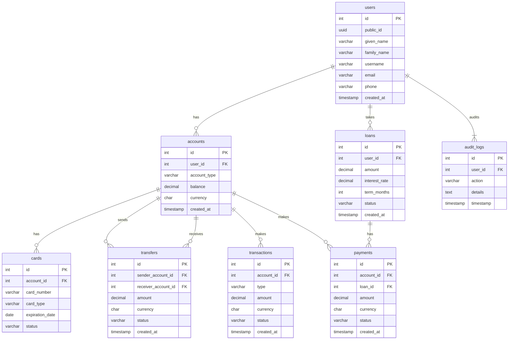

- [Intro](#intro)
- [Schema](#schema)
- [Indices](#indices)
- [Views](#views)
- [Caching](#caching)
- [Optimisation Benchmarking](#optimisation-benchmarking)
- [Cache Testing](#cache-testing)

## Intro
This repo was my experimenting with SQL optimisation and code level caching.
A simple banking PostgreSQL database is used with Rust for programming.

## Schema

## Indices
## Views
## Caching
## Optimisation Benchmarking
## Cache Testing
